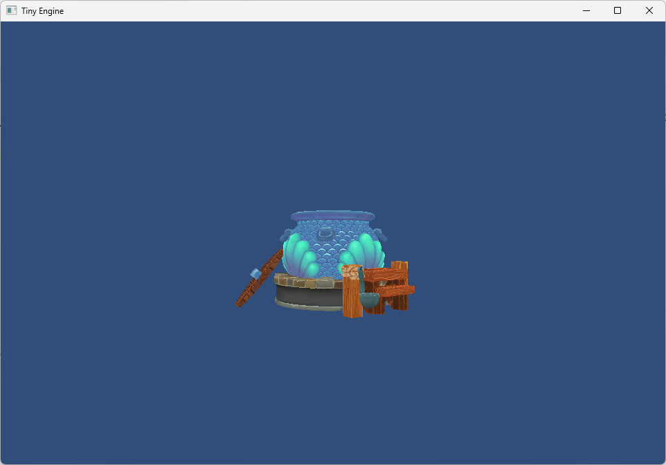

目前完成内容

- 自定义资源结构(obj->mesh, png->cpt)
- 基于 Component 的组件式框架结构
- transformer组件
- mesh组件
  - mesh_filter
  - mesh_renderer
- input系统
- camera
  - 正交/透视相机
  - 层级渲染
  - 剔除

TODO
- 文字
- ImGui 交互
- Lua绑定
- 多线程渲染
- 物理引擎
- 光照模型

